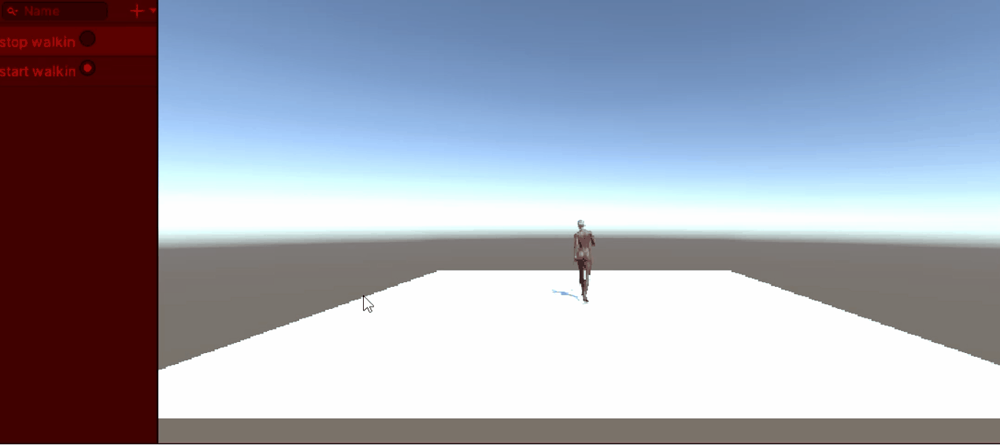
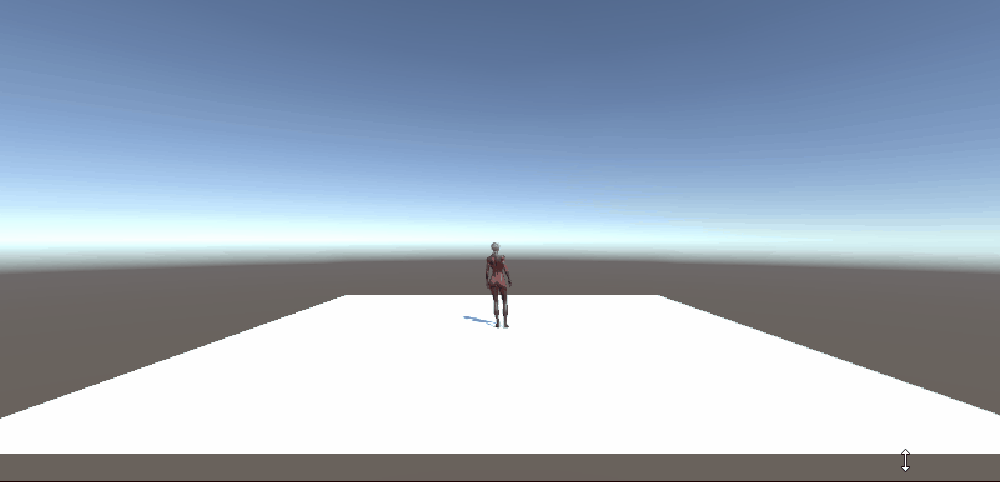
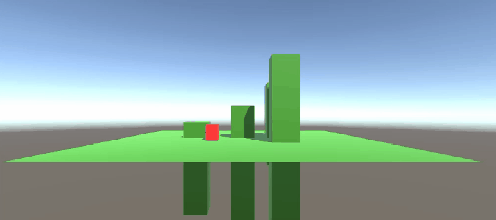

# BOM3

## Tutorial 1
ik heb een animatie van een lopend popetje. 

[Script animations](ArcadeM3/Assets/Scripts/Animation.cs)

## Tutorial 2
In deze tutorial heb ik een cube laten bewegen.

[Script Basicmove](ArcadeM3/Assets/Scripts/BasicMove.cs)

## Tutorial 3
In deze tutorial kun je zien hoe ik een cube laat springen en parkouren.

